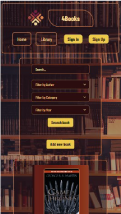
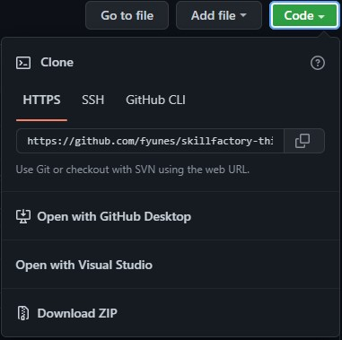

---


---

Exercise website for React course in Skill Factory - Avalith

 |  | 
| :---: | :---: | :---: |


## Technologies used

    	 


## Favorites of our team

| Fran|  Mel |  Fabri |  Alan
| :---: | :---: | :---: | :---: |

---

## Welcome to our project

||This project was created with [Create React App](https://github.com/facebook/create-react-app)|
| :---: | :---: |
  


## How to run our site

For this tutorial on how to set up and run our project we recommend using Visual Studio Code with its integrated terminal.

##### One of the easiest ways to do this, is to do as follows:

First copy the repository HTTPS address.

|

Then we should position ourselves in the directory we want our folder to be downloaded

Next, clone our repository using git clone + the HTTPS address.
Type in the Git terminal:

```
https://github.com/fyunes/skillfactory-third-project.git 
```

A folder will be created, access it by typing the following line in the terminal:

```
cd skillfactory-third-project
```

After that, you should install all dependencies for it to work properly running the following command:

```
npm install
```

If you do not wish to install them globally and to reduce long time issues you may also run:

```
npx install
```

###### Now you simply must enter

```
npm start
```

Then the app should start running smoothly without any issues.

### Happy hacking!

* * *
----------------------------

### Thank you for visiting our project!
... And reread that book you liked so much...

